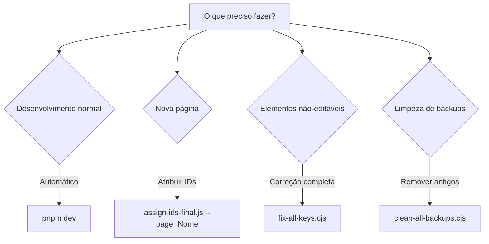

# 📑 Índice de Scripts - Acesso Rápido

**Última Atualização**: 08/11/2025

---

## 🎯 Começar Aqui

| Documento | Descrição | Para Quem |
|-----------|-----------|-----------|
| **[README.md](./README.md)** | Resumo executivo e quick start | Desenvolvimento diário |
| **[DOCUMENTACAO_SCRIPTS.md](./DOCUMENTACAO_SCRIPTS.md)** | Guia completo com todos os detalhes | Referência e troubleshooting |
| **INDEX.md** (este arquivo) | Navegação rápida | Acesso rápido |

---

## 🚀 Scripts Por Categoria

### ⭐ Scripts Principais (Use Estes)

#### 1. **Automático - Execução Diária**
```
init-assign-ids.js
├─ O QUE FAZ: Verifica e atribui IDs automaticamente
├─ QUANDO: Automático via `pnpm dev` (a cada 24h)
└─ COMANDO: pnpm dev (automático)
```

#### 2. **Manual - Atribuição Inteligente**
```
assign-ids-final.js ⭐ RECOMENDADO
├─ O QUE FAZ: Busca reversa inteligente, multi-linha, arrays
├─ QUANDO: Nova página, refatoração, troubleshooting
└─ COMANDO: node scripts/assign-ids-final.js [--dry-run] [--page=Name]
```

#### 3. **Manual - Correção Completa**
```
fix-all-keys.cjs (Script Mestre)
├─ O QUE FAZ: Executa fix-all-texts.js + fix-all-maps.js
├─ QUANDO: Manutenção mensal, muitos elementos não-editáveis
└─ COMANDO: node scripts/fix-all-keys.cjs
```

#### 4. **Manual - Limpeza**
```
clean-all-backups.cjs
├─ O QUE FAZ: Remove backups antigos (mantém 5 recentes)
├─ QUANDO: Mensalmente ou quando disco cheio
└─ COMANDO: node scripts/clean-all-backups.cjs
```

---

### 🔧 Scripts Auxiliares (Via fix-all-keys.cjs)

#### 5. **Correção de Textos**
```
fix-all-texts.js
├─ O QUE FAZ: Corrige elementos {texts.xxx}
├─ QUANDO: Raramente manual (use fix-all-keys.cjs)
└─ COBERTURA: 127 elementos
```

#### 6. **Correção de Arrays**
```
fix-all-maps.js
├─ O QUE FAZ: Corrige arrays .map()
├─ QUANDO: Raramente manual (use fix-all-keys.cjs)
└─ COBERTURA: 44 elementos em arrays
```

---

### 📚 Scripts Históricos (Não Usar)

#### 7-9. **Versões Antigas**
```
❌ assign-ids-smart.js     → Substituído por assign-ids-final.js
❌ assign-unique-ids.js     → Versão inicial (obsoleta)
❌ fix-map-arrays.js        → Substituído por fix-all-maps.js
```

---

## 🎯 Decisão Rápida: Qual Script Usar?



---

## 📊 Comandos Por Situação

### Situação 1: Criar Nova Página
```bash
# 1. Criar arquivos
# src/pages/NovaPage.tsx
# src/locales/pt-BR/NovaPage.json

# 2. Atribuir IDs (preview primeiro)
node scripts/assign-ids-final.js --page=NovaPage --dry-run

# 3. Aplicar
node scripts/assign-ids-final.js --page=NovaPage

# 4. Testar
# http://localhost:8080/436F6E736F6C45
```

### Situação 2: Grande Refatoração
```bash
# 1. Fazer mudanças no código
# 2. Executar correção completa
node scripts/fix-all-keys.cjs

# 3. Verificar no Admin Panel
# http://localhost:8080/436F6E736F6C45
```

### Situação 3: Elemento Não Aparece no Editor
```bash
# 1. Verificar console (F12)
# 2. Correção completa
node scripts/fix-all-keys.cjs

# 3. Se persistir, processar página com verbose
node scripts/assign-ids-final.js --page=ProblemPage --verbose

# 4. Verificar JSON existe
# src/locales/pt-BR/ProblemPage.json
```

### Situação 4: Limpeza Mensal
```bash
# Remover backups antigos (mantém 5 mais recentes)
node scripts/clean-all-backups.cjs
```

---

## 🔍 Verificação Rápida

### Status do Projeto
```bash
# Ver quantos IDs foram atribuídos
node scripts/assign-ids-final.js --dry-run | grep "Total de IDs"

# Ver estatísticas completas
cat scripts/README.md | grep "Cobertura Total" -A 5
```

### Verificar Backups
```bash
# Listar backups de JSON
Get-ChildItem "src/locales/pt-BR/" -Filter "*_*-*-*_*-*-*.json"

# Listar backups de CSS
Get-ChildItem "src/styles/pages/" -Filter "*_*-*-*_*-*-*.css"

# Contar total
(Get-ChildItem "src" -Recurse -Filter "*_*-*-*_*-*-*.*").Count
```

---

## 📚 Documentação Por Tópico

### Por Nível de Detalhe
| Nível | Documento | Páginas |
|-------|-----------|---------|
| ⚡ Quick Start | README.md | 1 página |
| 📖 Completo | DOCUMENTACAO_SCRIPTS.md | 15 páginas |
| 🗺️ Navegação | INDEX.md (este) | 1 página |

### Por Tipo de Uso
| Uso | Seção | Documento |
|-----|-------|-----------|
| Desenvolvimento diário | Quick Start | README.md |
| Criar nova página | Situação 2 | DOCUMENTACAO_SCRIPTS.md |
| Troubleshooting | Seção 🐛 | DOCUMENTACAO_SCRIPTS.md |
| Fluxo de trabalho | Seção 🔄 | DOCUMENTACAO_SCRIPTS.md |
| Referência de API | Seções 2-4 | DOCUMENTACAO_SCRIPTS.md |

---

## 🎓 Aprendizado Progressivo

### Nível 1: Iniciante (Dia 1)
```
1. Leia: README.md (seção Quick Start)
2. Execute: pnpm dev (automático)
3. Acesse: http://localhost:8080/436F6E736F6C45
4. Teste: Editar um título no Admin Panel
```

### Nível 2: Intermediário (Semana 1)
```
1. Leia: README.md (completo)
2. Execute: node scripts/assign-ids-final.js --dry-run
3. Crie: Uma nova página com JSON
4. Teste: Atribuir IDs na nova página
```

### Nível 3: Avançado (Mês 1)
```
1. Leia: DOCUMENTACAO_SCRIPTS.md (completo)
2. Entenda: Busca reversa, arrays, validação
3. Debug: Use --verbose para troubleshooting
4. Customize: Adapte scripts para necessidades específicas
```

---

## 📞 Suporte

### Problemas Comuns
| Problema | Solução | Documento |
|----------|---------|-----------|
| Elemento não-editável | fix-all-keys.cjs | DOCUMENTACAO_SCRIPTS.md § Troubleshooting |
| Edição não salva | Verificar JSON path | DOCUMENTACAO_SCRIPTS.md § Troubleshooting |
| IDs duplicados | fix-all-keys.cjs | README.md § Idempotência |
| Disco cheio | clean-all-backups.cjs | README.md § Quick Start |

---

## ✅ Checklist Final

**Antes de Commitar**:
- [ ] Executar `node scripts/fix-all-keys.cjs`
- [ ] Testar no Admin Panel
- [ ] Build: `pnpm build`
- [ ] Nenhum erro no console

**Antes de Deploy**:
- [ ] Limpar backups: `node scripts/clean-all-backups.cjs`
- [ ] Verificar IDs: `node scripts/assign-ids-final.js --dry-run`
- [ ] Build produção: `pnpm build`
- [ ] Testar: Todos os elementos editáveis

**Manutenção Mensal**:
- [ ] `node scripts/fix-all-keys.cjs`
- [ ] `node scripts/clean-all-backups.cjs`
- [ ] Revisar logs e estatísticas
- [ ] Atualizar documentação se necessário

---

## 🔗 Links Rápidos

- 📖 [README.md](./README.md) - Resumo executivo
- 📚 [DOCUMENTACAO_SCRIPTS.md](./DOCUMENTACAO_SCRIPTS.md) - Guia completo
- 🎨 [Admin Panel](http://localhost:8080/436F6E736F6C45) - Interface de edição
- 📂 [Locales](../src/locales/pt-BR/) - Arquivos JSON
- 🎨 [Styles](../src/styles/pages/) - Arquivos CSS
- 📄 [Pages](../src/pages/) - Componentes React

---

**📅 Criado**: 08/11/2025  
**✅ Status**: Atualizado  
**📊 Scripts**: 9 (6 ativos, 3 históricos)  
**🎯 Cobertura**: 171/171 elementos (100%)
